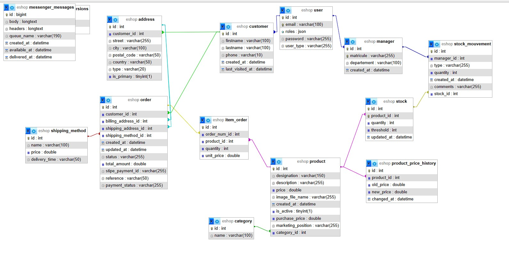
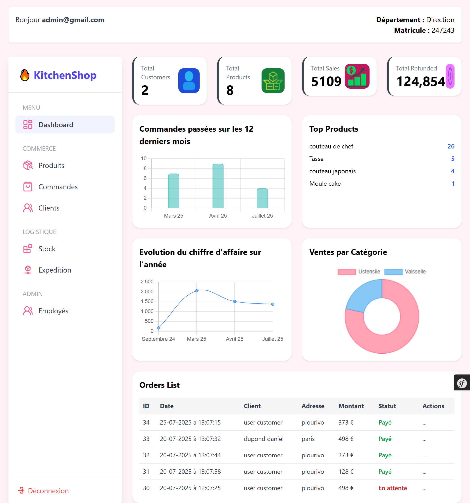

# Documentation Technique eShop

Description de la code base pour une meilleur navigation et compréhension

## 1️⃣ Préparation de la stack technique
- Symfony 7.2, PHP ≥ 8.2
- Twig pour les templates
- TailwindCSS pour le design
- Symfony UX : Stimulus + Live Components
- Stripe Checkout pour le paiement
- MySQL pour la base de données


## 2️⃣ Architecture du projet
- `/src/Controller` → gestion des routes et actions (front & admin)  
- `/src/Entity` → entités Doctrine (User, Product, Order, Stock…)  
- `/src/Repository` → requêtes personnalisées et méthodes spécifiques aux entités  
- `/src/Command` → commandes Symfony CLI personnalisées  
- `/src/Enum` → énumérations pour gérer les constantes typées (ex: statut de commande, type de transporteur)  
- `/src/EventListener` → écouteurs d’événements (ex: mise à jour stock après commande)  
- `/src/Exception` → exceptions personnalisées pour la gestion des erreurs métiers  
- `/src/Factory` → fabrique pour créer des objets complexes (ex: commandes, mouvements de stock)  
- `/src/Form` → formulaires Symfony (ex: ProductType, OrderType)  
- `/src/Security` → gestion des rôles, accès et authentification  
- `/src/Service` → services métiers (ex: StockManager, PaymentService, OrderManager)  
- `/src/Trait` → traits réutilisables pour du code partagé entre entités ou services  
- `/src/Utils` → classes utilitaires (ex: helpers pour le calcul de marges, formatage de prix)  
- `/src/Validator` → validateurs personnalisés pour Symfony Form et Entity  
- `/templates` → Twig templates (front, admin, emails)  
- `/assets` → JS, Stimulus controllers, TailwindCSS, images et fichiers statiques  


## 3️⃣ Schéma de la base de données
- Diagramme des entités principales : User, Product, Order, Stock, Movement
  
### 🔹 Relations principales 

- **User** → Customer / Manager : héritage (Doctrine Inheritance)
  - `Customer` → `Order` : 1-n
    - `Order` → `Product` : n-n via `OrderItem`
- `Product` → `Stock` : 1-1 ou 1-n (si plusieurs stocks par produit)
  - `Stock` → `Movement` : 1-n




## 4️⃣ Dashboard Admin

Le **Dashboard Admin** permet aux managers et administrateurs de suivre rapidement les indicateurs clés de l’eShop : clients, produits, ventes, stock et performances commerciales.


---
````yaml
Dashboard Controller (AccountAdminController)
│
│ injecte DashboardDataProvider
▼
DashboardDataProvider (service)
│
├─ récupère clients
├─ récupère produits
├─ récupère commandes payées et dernières commandes
├─ calcule top produits vendus
├─ calcule nombre de commandes par mois
├─ calcule chiffre d’affaires mensuel
└─ calcule ventes par catégorie
▼
Twig Template: admin/dashboard.html.twig
│
├─ Cartes statistiques (ItemDataCard)
├─ Graphiques (OrdersMonthChart, MonthlyRevenueChart, CategorySalesChart)
└─ Table dernières commandes
````

